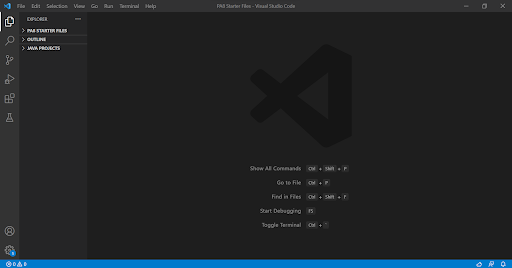

# Lab Report 1 Week 2
*By Andrew Reyes*

Here I will be giving a simple tutorial on how to log into your course specific account on `ieng6`

## Installing VS Code
***

Our first step in this tutorial will be to download and run Visual Studio Code. This will be the program we will use to log into our account. 

> If you already have VS Code downloaded on your device, then you may proceed to the next step below.

[Here](https://code.visualstudio.com/) is the website to download the program, and you would want to click on which ever operating system you are running to start downloading. 

Once you are finished and you open the program you will see a screen similar to this.
