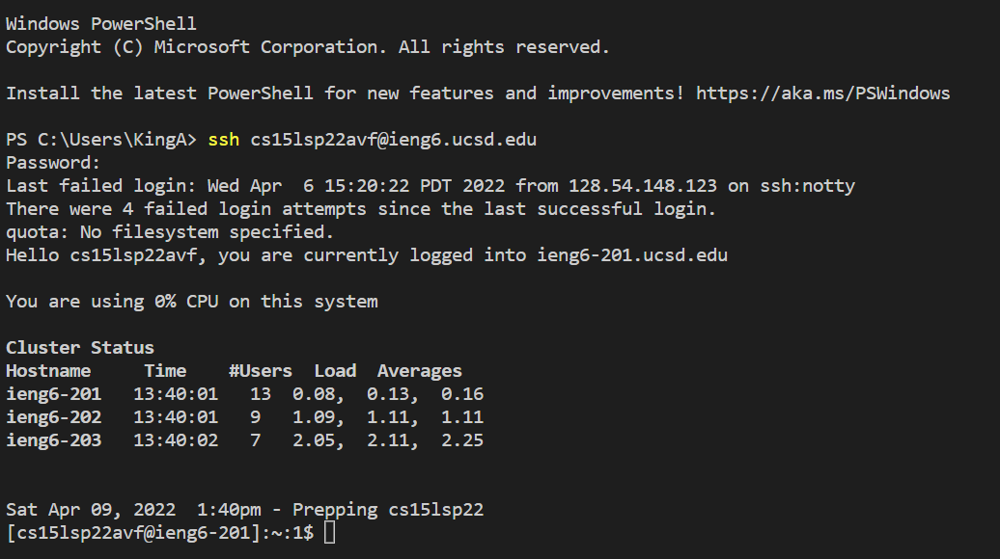

# Lab Report 1 Week 2
*By Andrew Reyes*

Here I will be giving a simple tutorial on how to log into your course specific account on `ieng6`

## Installing VS Code
***

* Our first step in this tutorial will be to download and run Visual Studio Code. This will be the program we will use to log into our account. 

> If you already have VS Code downloaded on your device, then you may proceed to the next step below.

* [Here](https://code.visualstudio.com/) is the website to download the program, and you would want to click on which ever operating system you are running to start downloading. 

* Once you are finished and you open the program you will see a screen similar to this.


## Remotely Connecting
***

* Our next step is we will want to download a program called [Open SSH](https://docs.microsoft.com/en-us/windows-server/administration/openssh/openssh_install_firstuse) onto our computers

> If you have Windows 10 (or above) already installed on your device then check in your settings and you should already have this program downloaded

* Once you are done downloading that program then you want to look up your course-specific account username [here](https://sdacs.ucsd.edu/~icc/index.php) that you will use to log into the ssh servers

It should be under __Additional Acounts__ header and look something like this, with the `zz` at the end replaced with your account specific username

`cse15lsp22zz`

* Hold onto this, and now open up the VS Code application and open up a new Terminal (click __Terminal__ up above and then __New Terminal__). Then you want to input the follow command into the command line below, making sure to replace the `zz` 

`$ ssh cse15lsp22zz@ieng6.ucsd.edu`

> If this is your first time logging into this server, then you will probably get a message similiar to whats shown down below. If then is the case then just say "yes" and continue on.

```
⤇ ssh cs15lsp22zz@ieng6.ucsd.edu

The authenticity of host 'ieng6.ucsd.edu (128.54.70.227)' can't be established.

RSA key fingerprint is SHA256:ksruYwhnYH+sySHnHAtLUHngrPEyZTDl/1x99wUQcec.

Are you sure you want to continue connecting
(yes/no/[fingerprint])?
```

* Once you select "yes" then you will be prompted to enter your course-specific password. After completeing this step then you should recieve a screen similiar to what's shown below. 



If you do then great! You are on the right path, but if not do not worry just refer back to the past steps for any clarification.

