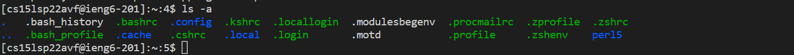
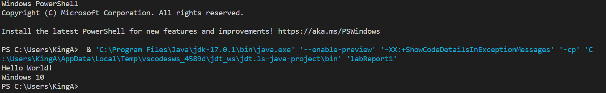
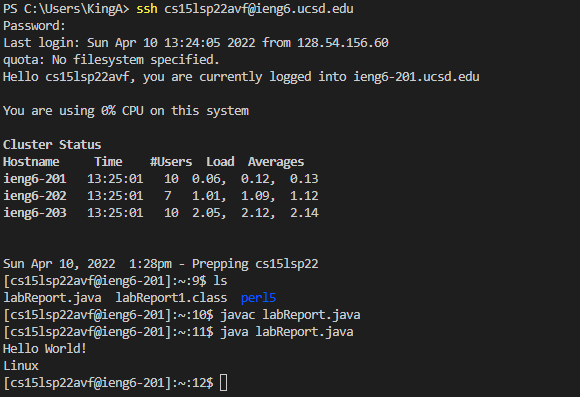
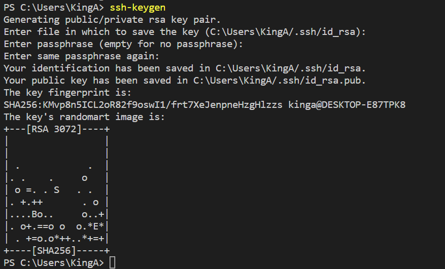
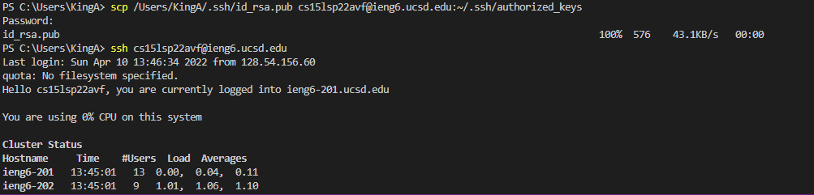

# Lab Report 1 Week 2
*By Andrew Reyes*

Here I will be giving a simple tutorial on how to log into your course specific account on `ieng6`

## Installing VS Code
***

* Our first step in this tutorial will be to download and run Visual Studio Code. This will be the program we will use to log into our account. 

> If you already have VS Code downloaded on your device, then you may proceed to the next step below.

* [Here](https://code.visualstudio.com/) is the website to download the program, and you would want to click on which ever operating system you are running to start downloading. 

* Once you are finished and you open the program you will see a screen similar to this.


## Remotely Connecting
***

* Our next step is we will want to download a program called [Open SSH](https://docs.microsoft.com/en-us/windows-server/administration/openssh/openssh_install_firstuse) onto our computers

> If you have Windows 10 (or above) already installed on your device then check in your settings and you should already have this program downloaded

* Once you are done downloading that program then you want to look up your course-specific account username [here](https://sdacs.ucsd.edu/~icc/index.php) that you will use to log into the ssh servers

It should be under __Additional Acounts__ header and look something like this, with the `zz` at the end replaced with your account specific username

`cse15lsp22zz`

* Hold onto this, and now open up the VS Code application and open up a new Terminal (click __Terminal__ up above and then __New Terminal__). Then you want to input the follow command into the command line below, making sure to replace the `zz` 

`$ ssh cse15lsp22zz@ieng6.ucsd.edu`

> If this is your first time logging into this server, then you will probably get a message similiar to whats shown down below. If then is the case then just say "yes" and continue on.

```
⤇ ssh cs15lsp22zz@ieng6.ucsd.edu

The authenticity of host 'ieng6.ucsd.edu (128.54.70.227)' can't be established.

RSA key fingerprint is SHA256:ksruYwhnYH+sySHnHAtLUHngrPEyZTDl/1x99wUQcec.

Are you sure you want to continue connecting
(yes/no/[fingerprint])?
```

* Once you select "yes" then you will be prompted to enter your course-specific password. After completeing this step then you should recieve a screen similiar to what's shown below. 


If you do then great! You are on the right path, but if not do not worry just refer back to the past steps for any clarification.

## Running Some Commands
___
Great! Now that we are connected to the server, lets try running some commands and see what we get.

[Here](https://www.codecademy.com/article/command-line-commands) is a website with some useful commands we could try and their descriptions.

Some examples are:
* `$ cd <Directory>/` which changes to that arguments directory
* `$ ls` which list out all of the files in the current directory

And here is an example of what you should expect to see in your command terminal. Here I input into my command terminal `$ ls -a` which lists all the files in my current directory including the hidden files.



You should also try some of these commands on your computer as well, not just on the remote computer. To log out of the server try `ctrl + D` and try some commands. To log back in just refer back to the previous steps on how to log in :)


## Moving Files with scp
___
Okay so now that we have some practice using commands and logging in and out of the ssh server, lets try to move some files back and forth between computers.

* Create a file called `labReport1` on your computer and put the following code into it:
```
class labReport1 {
    public static void main(String[] args) {
        System.out.println("Hello World!");
        System.out.println(System.getProperty("os.name"));
    }
}
```

* If we run this file on our computer we should see a screen similiar to this, keeping in mind that the line `System.out.println(System.getProperty("os.name"));` will print out the operating system of the computer we run this line on. Keep this in mind as we continue on.



* Now in order to move this file from our _client_ computer to our _remote_ computer, we want to use the `scp` command. We want to run this command into our terminal, making sure to use our username. It should ask you to type in your password and then press enter.

`$ scp labReport1.java cse15lsp22zz@ieng6.ucsd.edu`

* Once you complete this step then log back into the _remote_ computer with `ssh` and check if your file is there (`$ ls`). Once you see it, then try running the command like you would on your own computer. 

After completing these steps your screen should look similar to this:



# Setting an SSH Key
___
In order to having to bypass having to constantly retype our passwords when logging into our remote computer, we can create an ssh key. Lets do that now.

* So first we want to generate our keys and save them into a file on our computer. We can do this by entering `$ ssh-keygen` onto our computers terminal. It will then ask us to enter a file to say our key, in which we could just press enter. Then it will ask us to enter a passphrase and we have to make to to __KEEP IT EMPTY AND JUST PRESS ENTER__, in which it will ask us again we want to just press enter. 

Our screens should look similiar to this by the end of the last step: 



Now that we have created both our public and private keys, stored on our computer, we now want to copy the public key to the .ssh directory of our user account.

* Log into the remote computer using ssh,and once you enter your password and log in, enter the command `$ mkdir .ssh` and then log out. You shouldn't see anything new pop up on your terminal screen.

* Now log out of the remote computer (`ctrl + D`), and on your own computer type in the following command into the command terminal:

`$ scp /Users/<Username>/.ssh/id_rsa.pub cse15lsp22zz@ieng6.ucsd.edu:~/.ssh/authorized_keys`

> Make sure to replace <Username> with your computers username

Once we complete this step we should now be able to log into our user account on the remote computer without having to type our password. Try it out now, and it should look something like this.



After I copied the public key to the .ssh directory of our account, I was able to log in without having to type out my password.