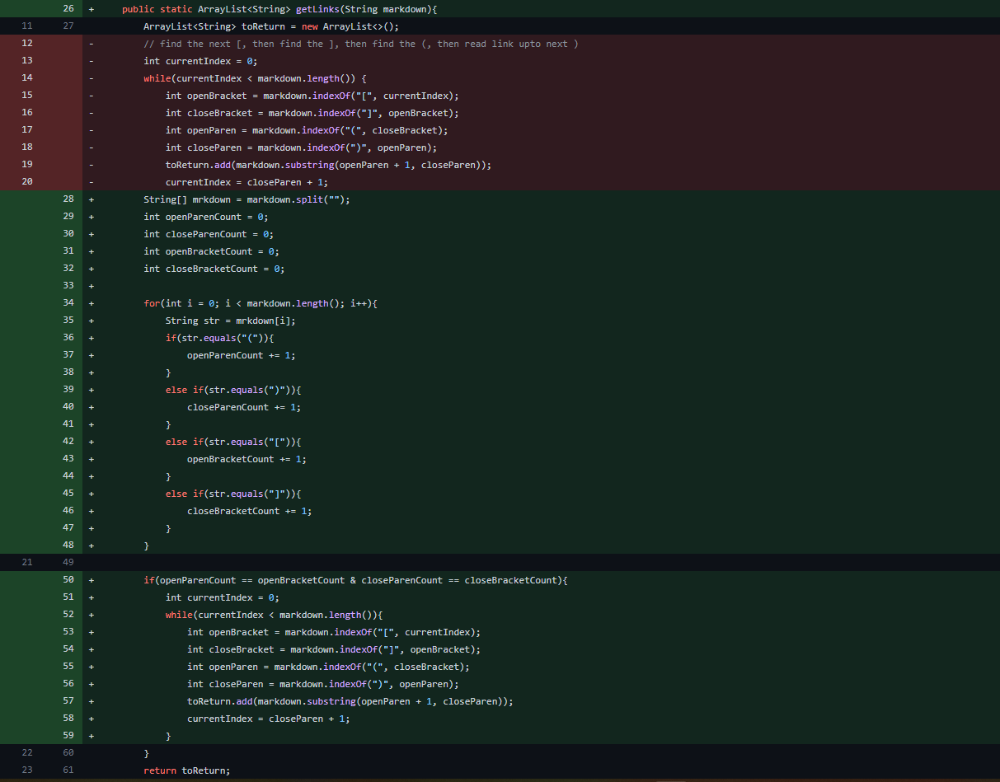
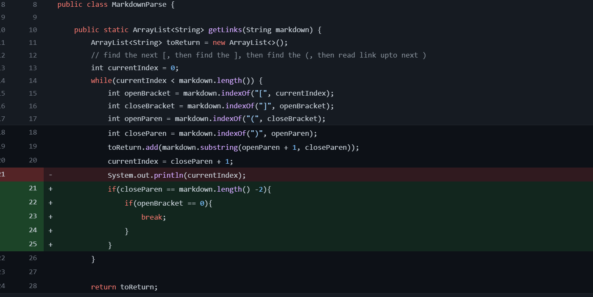

# Lab Report 2 Week 4
*By Andrew Reyes*  

\
<br/>
## First Code Change
___
<br/>



Here is the link to the [failure inducing input](https://github.com/KingAndrew3000/markdown-parser/blob/main/test-file-2.md) that prompted this code change

Here is the output of this failure-inducing input:

```
Exception in thread "main" java.lang.OutOfMemoryError: Java heap space
        at java.base/java.util.Arrays.copyOf(Arrays.java:3512)
        at java.base/java.util.Arrays.copyOf(Arrays.java:3481)
        at java.base/java.util.ArrayList.grow(ArrayList.java:237)
        at java.base/java.util.ArrayList.grow(ArrayList.java:244)
        at java.base/java.util.ArrayList.add(ArrayList.java:454)
        at java.base/java.util.ArrayList.add(ArrayList.java:467)
        at MarkdownParse.getLinks(MarkdownParse.java:19)
        at MarkdownParse.main(MarkdownParse.java:30)
```

<br/>

>So in this particular failure-inducing input the symptom that we are getting here is an exception, more specifically a runtime error due to insufficient space in the Java heap. This is more than likely due to an infinite loop inside of our code when we compile it, because on our testfile we have a link we no parenthesis but replaced with brackets. As a result of this, the code is trying to find the indexOf an open parenthesis and since there isn't one in the file, it results in an infinite loop.

\
<br/>

## Second Code Change
___
<br/>



Here is the link to the [failure inducing input](https://github.com/a3alani/markdown-parser/commit/ea2cf261c525710e8e2385782e63c6e6f187c2dd) that prompted this code change

<br/>

Here is the output of this failure-inducing input:

```
Exception in thread "main" java.lang.OutOfMemoryError: Java heap space
        at java.base/java.util.Arrays.copyOf(Arrays.java:3512)
        at java.base/java.util.Arrays.copyOf(Arrays.java:3481)
        at java.base/java.util.ArrayList.grow(ArrayList.java:237)
        at java.base/java.util.ArrayList.grow(ArrayList.java:244)
        at java.base/java.util.ArrayList.add(ArrayList.java:454)
        at java.base/java.util.ArrayList.add(ArrayList.java:467)
        at MarkdownParse.getLinks(MarkdownParse.java:41)
        at MarkdownParse.main(MarkdownParse.java:52)
```

<br/>

>So for this failure-inducing input we see that it has given us virtually the same type of error that our previous test case gave us, a runtime error. Again this is likely from an infinite loop running in our code when we try to parse through this test case. Though this test case was different because our file has both parenthesis and brackets in the link, there is an extra parenthesis at the end of the file, so that is why we recieved that error.

\
<br/>

## Third Code Change
___
