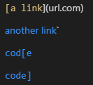
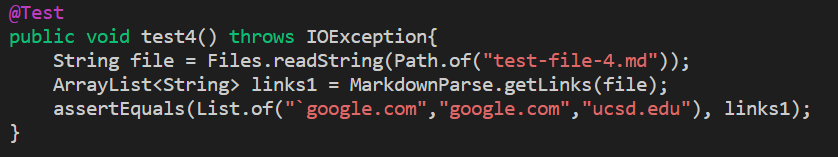
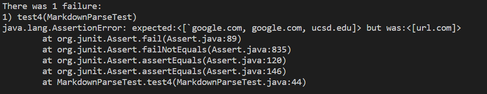

# Lab Report 4 Week 8
*By Andrew Reyes*

 

Here in the [link](https://github.com/KingAndrew3000/markdown-parser) to my own MarkdownParse repository

Here is the [link](https://github.com/kcyy127/markdown-parser) to the MarkdownParse implementation we reviewed

>Before I begin I would like to mention that the tool that I will be using to determine what each snippet should show is 
VScode preview

 

## Snippet #1
___

 

For Snipped #1, what the first test should produce is:

`[*google.com, google.com, ucsd.edu]`

>*The asterik should be a ` mark

and this is what that snippet looks like in VScode preview

 

Here is a screenshot of how I turned snippet #1 into a test in `MarkdownParseTest.java`:

 

* For **my** implementation, it failed when I ran the tests for Snippet #1 and the output it gave was

As you can see above, the output my program gave was `url.com` which is incorrect, hence why the test failed.

