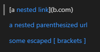
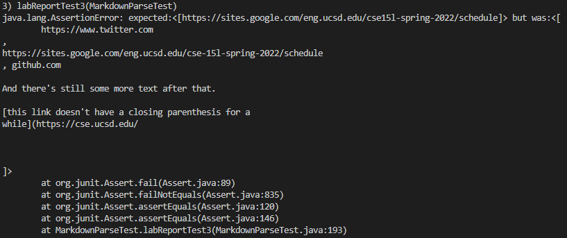

# Lab Report 4 Week 8
*By Andrew Reyes*

Here in the [link](https://github.com/KingAndrew3000/markdown-parser) to my own MarkdownParse repository

Here is the [link](https://github.com/kcyy127/markdown-parser) to the MarkdownParse implementation we reviewed

>Before I begin I would like to mention that the tool that I will be using to determine what each snippet should show is 
VScode preview

 

## Snippet #1
___

For Snippet #1, what the first test should produce is:

`[*google.com, google.com, ucsd.edu]`

>*The asterik should be a ` mark

and this is what that snippet looks like in VScode preview

 

Here is a screenshot of how I turned snippet #1 into a test in `MarkdownParseTest.java`:

 

* For **my** implementation, it failed when I ran the tests for Snippet #1 and the output it gave was

As you can see above, the output my program gave was `url.com` which is incorrect, hence why the test failed.

 

* For the **implementation I reviewed**, it failed also when I ran the test for Snippet #1 and the output was 

As you can see above, the output the program gave was almost correct except that it also returned url.com,which is false and why the test failed.

 

> For my program, I don't think there is a small code change that could work for Snippet #1. The reason being that how I 
would fix it is by splitting the markdown string by every character into a string array. Then I would iterate through that entire array and count every instance of an open and close bracket and ticks as well. Then in my main while loop if 
there are ticks then I would get the index of those and then check if there are any cases of one tick mark inside a bracket and one outside then I would break the loop right there.

\
 

## Snippet #2
___

For Snippet #2, what the test should produce is:

`[a.com, a.com((, example.com]`

and this is what that snippet looks like in VScode preview

 

Here is a screenshot of how I turned snippet #2 into a test in `MarkdownParseTest.java`:

 

* For **my** implementation, it failed when I ran the tests for Snippet #2 and the output it gave was

as you can see above the output my program gave was only `a.com`, which is one of the correct answers but not all of them 
hence why it failed

 

* For the **implementation I reviewed**, it failed also when I ran the test for Snippet #2 and the output was 

As you can see the implementation we reviewed failed because it didn't return example.com, but it did return the other too. Despite this though eventually it did fail.

 

> I don't think there is a small code change that I could make for my implementation in order for it to return the correct url links for this snippet. The reason being in because in this snippet we are given nested links inside of parenthesis and also inside of brackets. So I feel if I were to correct this code to give me the correct urls I again would first break up each line by using the split method, and then I would count the amount of open and closed parenthesis and brackets. Then before I get the urls I would count the amount of them to see if they add up and see where they land in terms of their index and where the url I am lookin at is at in between these brackets and parenthesis.

\
 

## Snippet 3
___

For Snippet #3, what the test should produce is:

`[https://sites.google.com/eng.ucsd.edu/cse-15l-spring-2022/schedule]`

and this is what the snippet looks like in VSCode Preview

 

Here is a screenshot of how I turned snippet #3 into a test:

 

* For **my** implementation, it failed when I ran the test for Snippet #3 and the output it gave was 

and as you can see above the output that it gave was a blank like followed by `https://www.twitter.com`, which is incorrect.

 

* For the **implementation I reviewed**, it failed also when I ran the test for Snippet #3 and the output was 

as you can see it gave me the wrong output because although it did have the link that was correct, it also returned text that was before and after that url as well so it is incorrect. 

> I think for my implementation of markdown parser, I think that I might be able to implement a code change that will be able to work for this. What I would do is just read the lines of the file one line at a time, and if there is a line that has no characters then I would not use that url and move on to the next url line. 

