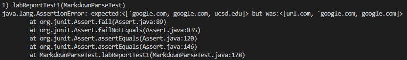

# Lab Report 4 Week 8
*By Andrew Reyes*

Here in the [link](https://github.com/KingAndrew3000/markdown-parser) to my own MarkdownParse repository

Here is the [link](https://github.com/kcyy127/markdown-parser) to the MarkdownParse implementation we reviewed

>Before I begin I would like to mention that the tool that I will be using to determine what each snippet should show is 
VScode preview

 

## Snippet #1
___

For Snipped #1, what the first test should produce is:

`[*google.com, google.com, ucsd.edu]`

>*The asterik should be a ` mark

and this is what that snippet looks like in VScode preview

 

Here is a screenshot of how I turned snippet #1 into a test in `MarkdownParseTest.java`:

 

* For **my** implementation, it failed when I ran the tests for Snippet #1 and the output it gave was

As you can see above, the output my program gave was `url.com` which is incorrect, hence why the test failed.

 

* For the **implementation I reviewed**, it failed also when I ran the test for Snippet #1 and the output was 

As you can see above, the output the program gave was an empty array, meaning that it didn't get any urls, hence why the test failed.

 

> For my program, I don't think there is a small code change that could work for Snippet #1. The reason being that how I 
would fix it is by splitting the markdown string by every character into a string array. Then I would iterate through that entire array and count every instance of an open and close bracket and ticks as well. Then in my main while loop if 
there are ticks then I would get the index of those and then check if there are any cases of one tick mark inside a bracket and one outside then I would break the loop right there.

\
 

## Snippet #2
___

For Snipped #2, what the first test should produce is:

`[a.com, a.com((, example.com]`

and this is what that snippet looks like in VScode preview

 

Here is a screenshot of how I turned snippet #2 into a test in `MarkdownParseTest.java`:

 

* For **my** implementation, it failed when I ran the tests for Snippet #2 and the output it gave was

as you can see above the output my program gave was only `a.com`, which is one of the correct answers but not all of them 
hence why it failed

 

* For the **implementation I reviewed**, it failed also when I ran the test for Snippet #2 and the output was 

