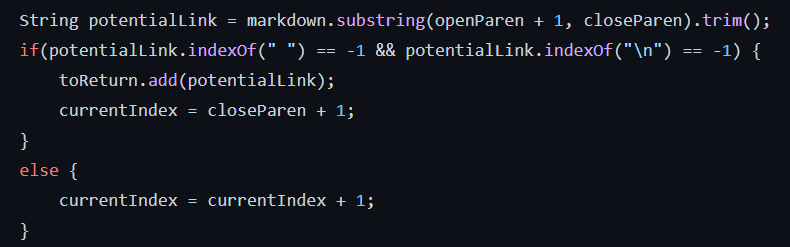

# Lab Report 5 Week 10
*By Andrew Reyes*

 

## Explanation
---

>How I found the results for both tests on both implementations was I ran a bash for loop that went through each test file, printed out its name and its output. I stored those results in a .txt file for both implementations and I used `vimdiff` on the resulting .txt files to see the differences.

Here is the link to the [first](https://github.com/nidhidhamnani/markdown-parser/blob/main/test-files/504.md) testfile that I will be explaining

And here is the [second](https://github.com/nidhidhamnani/markdown-parser/blob/main/test-files/495.md) testfile

\
 

## First Test-file
---

> For this first test file, the implementation that was correct was my own implementation. Note that for this screenshot and for the next one showing my vimdiff results, my implementation results are on the left and the other is on the right.

These were the **actual** outputs that both implementations gave us:

My implementation gave the output

 `[/url "title", /url 'title', /url(title]`

and the other gave 

`[]`

 

What the **expected** output should have been based off of what we get using VScode preview are:

`[/url "title", /url 'title', /url(title]`

because using VScode preview running in the testfile we get:

which indicates we should have gotten all three links printed out for the output.

### What we should fix:
* Now since the given implementation failed on that testfile, we see that the issue with it is that it is looking for an instance of a " " blank space in the markdown file line. Since there is a space in our, in their code if they find a space where the url should be it does not return that url. Here is the area of the code I am talking about. 

\
 

## Second Test-file
---

> For this first test file, the implementation that was correct the given implementation from lab 9. Note my implementation results are on the left and the other is on the right.

These were the **actuall** outputs both implementations gave us:

My implementation gave the output

 `[foo(and(bar]`

and the other gave 

`[foo(and(bar))]`

 

What the **expected** output should have been based off of what we get using VScode preview are:

`[foo(and(bar))]`

because using VScode preview running in the testfile we get:

indicating that the given implementation gave out the correct output.

### What we should fix:
* Now since the our given implementation failed, *but* it almost gave out the correct output, we can see that the bug results in us not checking to see if our parenthesis inside out links close. What I mean by this is that our implementation returned the link once it found the first instance of a closed parenthesis. What it should have done is checked and stored the amount of open paranthesis inside the link, to make sure we stop at the correct closed one. Here is the code that gives us this bug:

